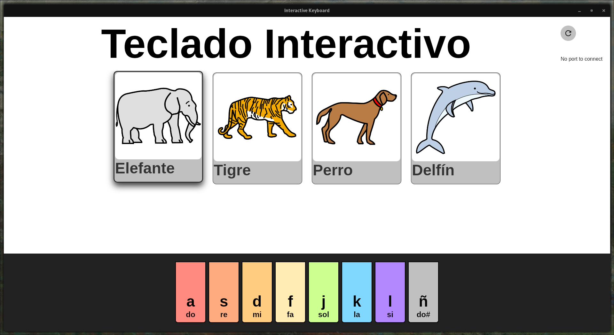

# interactive keyboard
interactive keyboard with animal sounds for inclusive learning. Project for the [PDI](https://estudos.udc.es/es/subject/614G01V01/614G01035/2024) subject at UDC [GEI](https://estudos.udc.es/es/study/detail/614g01v01)

# structure
- [app](./app/README.md): multiplatform client for interactive keyboard
- [esp32](./esp32/README.md): mycropython script for the ESP32 microcontroller
- [docs](./docs/README.md): simplified version of the FIC TFG report (in LaTeX)

# install
download the last release from [releases](https://github.com/daniqss/interactive-keyboard/releases), or build it from source after installing all of the Tauri dependencies listed in [app](./app/README.md). To load the micropython script to the microcontroller, follow the instructions in [esp32](./esp32/README.md)